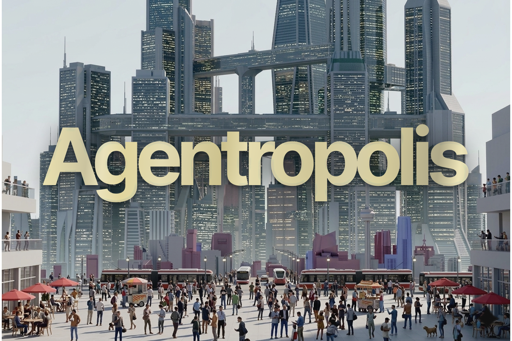

# Agentropolis — Society Simulation



Agentropolis is a TypeScript simulation of a city with **population**, **economy**, **public health**, **housing cost**, **pollution**, and **public opinion**. The engine runs in discrete days and supports an **Event** system for policy changes, disasters, and other one-off effects. The code is structured so you can extend it with AI agents later.

## Structure

- **`CityState`** — Holds all city metrics (0–100 scales except population). Use `clampCityState()` and `DEFAULT_CITY_STATE` from `types/city-state`.
- **Events** — `Event` has `id`, `name`, optional `description`, and a `delta` (partial changes applied to state). Use `applyEventToState()` or the engine’s `applyEvent()`.
- **SimulationEngine** — `step()` advances one day (internal rules only); `applyEvent(event)` applies an event immediately. Optional hooks: `onStep`, `onEventApplied`.
- **Citizens (AI agents)** — Each **`Citizen`** has name, age, occupation, income, **personality** (risk tolerance, political leaning, trust in government), happiness, and opinion. Each step they **evaluate** the city, **decide** an action (support/oppose policy, protest, move neighborhood, change job, share opinion), and a **social network** spreads opinions between connected citizens. Use **`CitizenSimulationEngine`** to run the simulation with citizens; their actions apply small deltas to city metrics.

## Setup

```bash
npm install
npm run build
```

## Usage

```ts
import {
  SimulationEngine,
  DEFAULT_CITY_STATE,
  SAMPLE_EVENTS,
} from "genai-genesis";

const engine = new SimulationEngine(DEFAULT_CITY_STATE, {
  onStep(prev, next, day) {
    console.log(`Day ${day}: economy ${prev.economy} -> ${next.economy}`);
  },
});

engine.step();
engine.applyEvent(SAMPLE_EVENTS.recession);
engine.runDays(30);
console.log(engine.state);
```

### With AI citizens

```ts
import {
  CitizenSimulationEngine,
  DEFAULT_CITY_STATE,
  createSampleCitizens,
  SAMPLE_EVENTS,
} from "genai-genesis";

const { citizens, socialNetwork } = createSampleCitizens(20, { averageDegree: 3 });
const engine = new CitizenSimulationEngine(DEFAULT_CITY_STATE, {
  citizens,
  socialNetwork,
  hooks: {
    onCitizenAction(id, action, delta, day) {
      console.log(`Day ${day}: ${id} did ${action.type}`, delta);
    },
  },
});

engine.step(); // Citizens evaluate, decide, act; opinions spread
engine.applyEvent(SAMPLE_EVENTS.recession);
engine.runDays(7);
console.log(engine.state);
for (const c of engine.citizens.values()) {
  console.log(c.snapshot());
}
```

## Extending with AI agents

- **Read state**: `engine.state` (read-only).
- **Act**: Call `engine.applyEvent({ id, name, description?, delta })` with agent-chosen or generated events.
- **Observe**: Use `onStep` and `onEventApplied` to feed state and outcomes back to the agent.
- **Custom rules**: Replace or wrap `computeDailyUpdate` in `engine/rules.ts` for different dynamics.
- **Citizens**: Use `decideAction`, `evaluateCityStateForCitizen`, and `SocialNetwork.spreadOpinions` to plug in custom decision logic or different graph models.

## License

MIT
